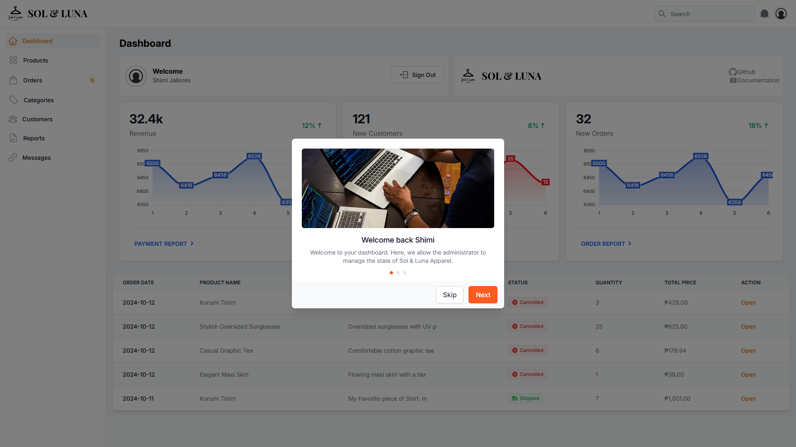

# ✨ Sol & Luna Dashboard

Welcome to **Sol & Luna Dashboard**, a modern and sleek admin dashboard specifically created for the efficient management of eCommerce Shopping Platform Sol & Luna Apparel. The dashboard is equipped with robust monitoring tools and pages that allows administrators to monitor the state of the platform.


## Screenshots




## Demo

Check out the live demo of the project [Sol & Luna Admin Dashboard](https://admin.solapparel.live).

## Installation

Install my-project with Git

```bash
  git clone https://github.com/CainMcRolan/Sol-And-Luna-Dashboard.git
  cd Sol-And-Luna-Dashboard

```

Install dependencies with Composer

```bash
  composer install
```

Add an .env file

```bash
  DATABASE_HOSTNAME=''
  DATABASE_USERNAME=''
  DATABASE_PASSWORD=''
  DATABASE_PORT=''
  DATABASE_NAME=''
  DATABASE_CHARSET=utf8mb4

  PUSHER_AUTH_KEY=''
  PUSHER_SECRET=''
  PUSHER_APP=''
  PUSHER_CLUSTER=''
```

## Tech Stack

**Client:** Alpine.js, TailwindCSS

**Server:** PHP


## Author

- [@PatriarchCain](https://www.github.com/CainMcRolan)

